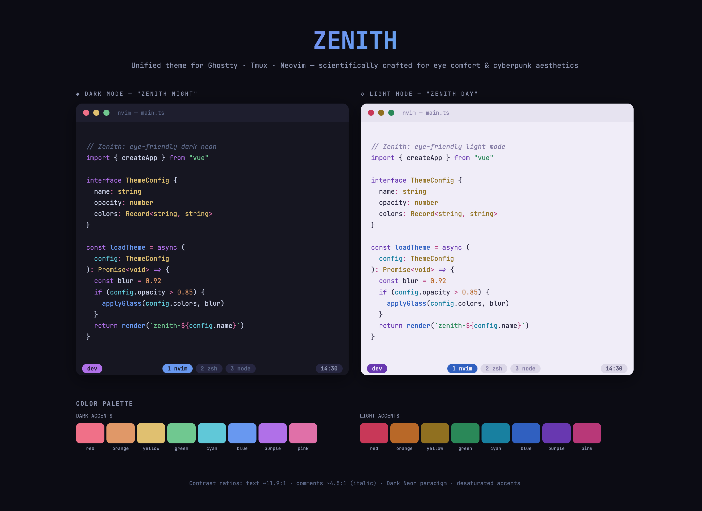

# Zenith

Unified color theme for **Ghostty** + **Tmux** + **Neovim** — scientifically crafted for eye comfort & cyberpunk aesthetics.



## Design Principles

| Principle | Implementation |
|-----------|---------------|
| **Dark Neon paradigm** | Deep blue-violet base `#161621` (L\*≈9), never pure black |
| **Text contrast sweet spot** | Primary text ~11.9:1, comments ~4.5:1 (italic) |
| **Blue light reduction** | Warm-shifted backgrounds, cyan/teal over pure blue |
| **Desaturated neon accents** | All accent colors reduced 15-25% from pure values |
| **Depth-of-field effect** | `dim_inactive` darkens non-focused splits in Neovim |

Both **dark** and **light** modes available, with a single-command toggle across all three tools.

## Structure

```
palette.toml          ← Single source of truth for all colors
generate.py           ← Reads palette, generates all configs
install.sh            ← Symlinks configs to correct locations
switch.sh             ← Toggle dark/light across ghostty+tmux+nvim
dist/
├── ghostty/          ← Theme files + config snippet
├── tmux/             ← Rounded pill tabs, Nerd Font icons + truecolor passthrough
└── nvim/zenith.nvim/ ← Full Lua colorscheme plugin (200+ highlight groups)
```

## Quick Start

```bash
# Generate all configs from palette.toml
python3 generate.py

# Install everything
./install.sh

# Or install individual components
./install.sh --ghostty
./install.sh --tmux
./install.sh --nvim

# Switch modes (updates ghostty + tmux + neovim simultaneously)
./switch.sh dark      # or: light, toggle
```

### Ghostty

Append the snippet from `dist/ghostty/config-snippet` to `~/.config/ghostty/config`:

```
theme = zenith-dark
font-family = "JetBrainsMono Nerd Font"
font-size = 16
font-thicken = true
background-opacity = 0.92
background-blur-radius = 20
```

### Tmux

Zenith tmux themes use the `@tape_*` variable convention, making them a **drop-in replacement** for existing theme files. Install drops themes into `~/.tmux/themes/`:

```
~/.tmux/themes/
├── zenith-dark.conf    ← defines @tape_* palette + refreshes styles
└── zenith-light.conf
```

Update `~/.tmux.conf` theme loading:

```tmux
if-shell "grep -q dark ~/.tmux/theme_state" \
  "source-file ~/.tmux/themes/zenith-dark.conf" \
  "source-file ~/.tmux/themes/zenith-light.conf"
```

Optional: add truecolor + undercurl passthrough (replaces `xterm-256color`):

```tmux
source-file ~/.tmux/themes/truecolor.conf
```

All your existing plugins (battery, CPU, pomodoro, weather, etc.), keybindings, status bar layout, and `icons.sh` work unchanged — only the colors change.

### Neovim

With [lazy.nvim](https://github.com/folke/lazy.nvim):

```lua
{
  dir = "~/.local/share/nvim/site/pack/zenith/start/zenith.nvim",
  priority = 1000,
  config = function()
    require("zenith").setup({
      dim_inactive = true,   -- depth-of-field effect
      transparent = false,   -- set true for glass background
    })
    vim.cmd("colorscheme zenith")
  end,
}
```

Or simply add to your `init.lua`:

```lua
vim.cmd("colorscheme zenith")
```

## Palette

Edit `palette.toml` to customize colors, then re-run `python3 generate.py` to regenerate all configs.

### Dark Mode Accents

| Color | Hex | Role |
|-------|-----|------|
| Red | `#f07088` | Errors, deletions, JSX tags |
| Orange | `#e09868` | Constants, numbers |
| Yellow | `#e0c070` | Types, warnings |
| Green | `#70c890` | Strings, additions |
| Cyan | `#60c8d8` | Parameters, attributes |
| Blue | `#6898f0` | Functions |
| Purple | `#b070e8` | Keywords (cyberpunk anchor) |
| Pink | `#e070a8` | Operators, regex, special |

### Neovim Plugin Coverage

Treesitter, LSP Semantic Tokens, Diagnostics (undercurl), GitSigns, Telescope, nvim-cmp, Neo-tree, Lazy.nvim, Which-key, nvim-notify, indent-blankline, Mini, Lualine.

## Requirements

- Python 3.11+ (for `tomllib`)
- [Nerd Font](https://www.nerdfonts.com/) (JetBrains Mono recommended)
- Ghostty, Tmux, Neovim 0.9+

## License

MIT
